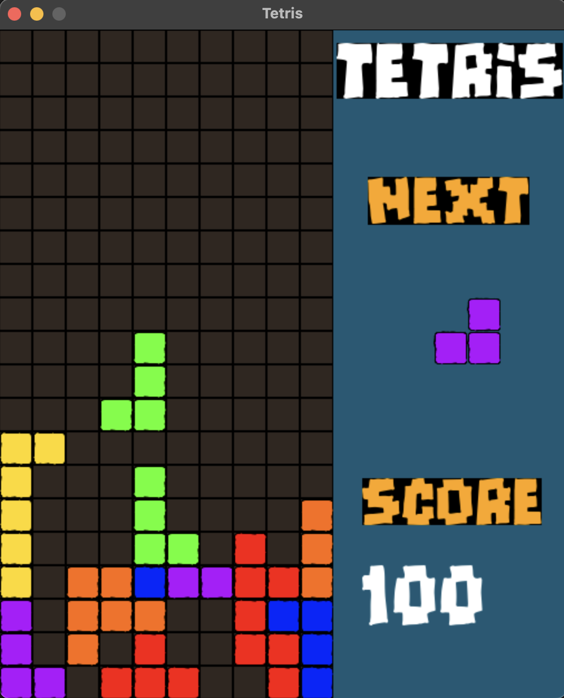

# byte-builders

A repository made for Foundations of Software Engineering project building.

The chosen language for this project is Python.

Style for this project shall be dictated by PEP 8 - Style Guide for Python Code.

<https://peps.python.org/pep-0008/>

## To contribute to the project

- Create an issue that explains the problem you are trying to solve.
- Create a branch where the name describes your issue or change.
- Clone your branch to a local repository.
- Write, add, and commit your changes to your branch.
- Create a pull request into the Master branch with yours as the head.
- There shall be a default reviewer assigned.
- All threads commented on the pull request must be resolved.
- Upon approval, the pull request will be merged.

To learn how to set up an SSH key and clone a git repository
read the following article:

<https://phoenixnap.com/kb/git-clone-ssh>

## Release

To release our project, I have chosen to use the Python module pyinstaller.
There are many benefits to pyinstaller, such as single file install which
make delivering software incredibly clean, and easy.  In addition, you are able
to run the executable without any of the needed modules installed on the target
audiences computer, (even Python!).

To create a release, `cd` into the directory of your project,
and run `pyinstaller -F main.py` this creates a `dist` directory
where the main executable that is created resides.  We then create
a release folder in our main repository, and copy the executable
to this location along with all of the assets required by our project.
Lastly, we zip the folder up, naming it project_name.zip which imagine
will change to the required format for our team project submittal.
This gets stored back into the same folder we just zipped up for ease
of cleaning, and cleanliness of our repo.

A closer look at how `pyinstaller` works can be read about here:

<https://pyinstaller.org/en/stable/>

## Template

Within the template folder there is a hello.py file to help detail what
file contributions should be stuctured like.  To run this file, navigate
to the corresponding folder in a CLI and enter `make project`.  This will
run a series of defined commands as well as the hello.py file.  You should
then see the following output appear in your terminal.

## Tetris

This game was created following a tutorial on Youtube by Coder Space.

Youtube Tutorial:

<https://www.youtube.com/watch?v=RxWS5h1UfI4>

Github:

<https://github.com/StanislavPetrovV/Tetris/tree/main>

The primary goal behind the creation of this game is to help define
an overall baseline for the creation of our project Trivial Compute.
In this tutorial, we can find common programming patterns that define
the creation of our game graphical interface, logic, and much more.

Additionally, we use this game to help define base functionality for the team
to assure that there is a common ability for everyone to run the project
in its current configuration.  Testing can also be done for future configuration
pertaining to project deliverables and other experimental ideas prior
to their integration.

To run any of the following actions in the top level directory from your CLI
and enter the corresponding commands.

### Makefile commands

To install all needed dependencies:
`make setup_tetris`

To run:
`make tetris`

To clean any unneeded files:
`make clean_tetris`

To create a packaged release executable:
`make release_tetris`

To test your newly packaged release:
`test_release_tetris`

### Controls

`UP`: Rotate block
`LEFT`, RIGHT: Move block
`DOWN`: Speed block to the bottom
`M`: Mute
`ESC`: Quit game
