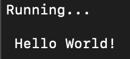

# byte-builders

A repository made for Foundations of Software Engineering project building.

The chosen language for this project is Python.

Style for this project shall be dictated by PEP 8 - Style Guide for Python Code. https://peps.python.org/pep-0008/

To contribute to the project

- Create a branch where the name describes your change.
- Clone your branch to a local repo
- Write, add, and commit your changes to your branch.
- Create a pull request into the Master branch with yours as the head.
- There shall be a default reviewer assigned.
- All threads commented on the pull request must be resolved.
- Upon approval, the pull request will be merged.

To learn how to set up an SSH key and clone a git repository
read the following article.

https://phoenixnap.com/kb/git-clone-ssh

Within the template folder there is a hello.py file to help detail what
file contributions should be stuctured like.  To run this file, navigate
to the corresponding folder in a CLI and enter `make project`.  This will
run a series of defined commands as well as the hello.py file. You should
then see the following output appear in your terminal.

